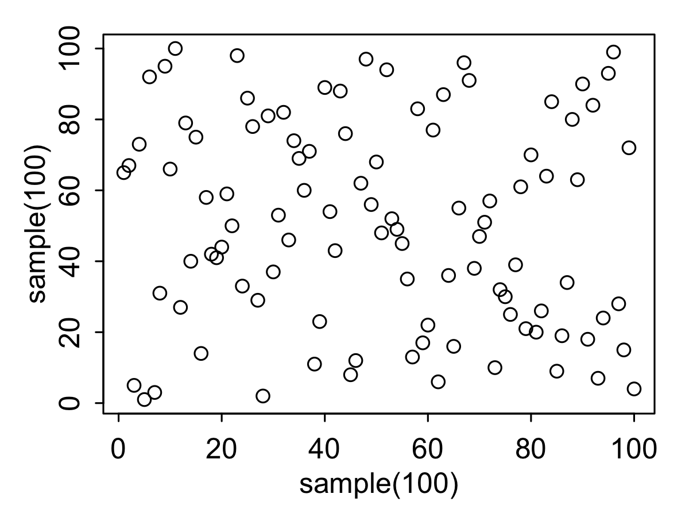
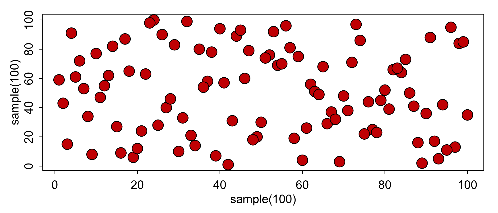

PLOTTING IN R!
========================================================
author: Hilary Dugan
date: Feb 28, 2017
autosize: true
transition: linear
width: 1920
height: 1080

Why should I use R for figures? 
========================================================
type: prompt
- Reproducibility
- Consistency  
- Sharing code
- Many output types, high resolution

When not to use R?
========================================================
type: prompt

-  “quick additions”
- A ton of text 
- Conceptual figures 

Illustrator 
- Nice because figures are linked
- But expensive
- Bad for sharing 

Powerpoint
- Everyone has it... Is that a good enough reason?

Plotting in R
========================================================


```r
plot(sample(100),sample(100))
```


 
Plotting in R
========================================================

```r
par(mar=c(3,3,1,1), mgp=c(1.5,0.5,0), tck=-0.02)
plot(sample(100),sample(100))
```


Plotting in R
========================================================
left: 50%
</br>

```r
plot(sample(100), sample(100))
```


 
 ***

```r
par(mar=c(3,3,1,1), mgp=c(1.5,0.5,0), tck=-0.02)
plot(sample(100), sample(100))
```



Colors in R - colors()
========================================================

```r
par(mar=c(3,3,1,1), mgp=c(1.5,0.5,0), tck=-0.02)
plot(sample(100), sample(100), pch=21, bg='red3', cex=2)
```



Alpha Channel in R
========================================================


```r
add.alpha <- function(col, alpha=1) {
 apply(sapply(col, col2rgb)/255, 2,
       function(x)
         rgb(x[1], x[2], x[3], alpha=alpha)) 
}
```
Alpha Channel in R
========================================================

```r
par(mar=c(3,3,1,1), mgp=c(1.5,0.5,0), tck=-0.02)
plot(sample(100), sample(100), pch=21, bg=add.alpha('red3',0.7), cex=2)
```


Multipanel Figures
========================================================
type:prompt
A few options in R
- par(mfrow = c(1,2))
  - very easy, Hilary uses 50% of the time
- layout(matrix(c(1,1,2,3), 2, 2, byrow = TRUE))
  - confusing, Hilary uses 0% of the time
- par(fig = c(0,0.8,0,0.8), new = TRUE)
  - harder, but useful, Hilary uses 50% of the time

Multipanel Figures
========================================================

```r
par(mar=c(3,3,1,1), mgp=c(1.5,0.5,0), tck=-0.02, mfrow=c(2,1))
plot(sample(100), sample(100), pch=21, bg=add.alpha('red3',0.7))
plot(sample(100), sample(100), pch=21, bg=add.alpha('slateblue',0.7))
```


Multipanel Figures
========================================================

```r
par(mar=c(3,3,1,1), mgp=c(1.5,0.5,0))
par(fig=c(0,0.6,0,0.6))
plot(sample(100), sample(100),  pch=21,bg=add.alpha('red3',0.7))
par(fig=c(0.6,1,0,1), new = TRUE)
plot(sample(100), sample(100), pch=21, bg=add.alpha('slateblue',0.7))
```


Font Size - Setting pointsize with 'ps'
========================================================

```r
par(mar=c(3,3,1,1), mgp=c(1.5,0.5,0), tck=-0.02,ps=18)
plot(sample(100), sample(100), pch=21, bg=add.alpha('red3',0.7))
par(ps=14)
mtext(side = 3,line = 0,text = 'title')
```


Saving files
========================================================
Many figure formats 
- jpeg (small)
- pdf(small, great resolution)
- tiff (huge)
- png (Hilary's favorite)


```r
png('file.png')
...
dev.off()
```

Saving files
========================================================

```r
png('file.png',height = 5,width = 8,units = 'in',res = 300)
  par(mar=c(3,3,1,1), mgp=c(1.5,0.5,0), tck=-0.02)
  plot(sample(100), sample(100), pch=21, bg=add.alpha('red3',0.7), cex=2)
dev.off()
```

```
quartz_off_screen 
                2 
```

Saving files - Posters
========================================================

```r
png('file_poster.png',height = 5,width = 8,units = 'in',res = 300)
  par(mar=c(3,3,1,1), mgp=c(1.5,0.5,0), tck=-0.02, cex=2, bg='black',
    col.lab='grey90', col.axis='grey90', fg='grey90')
  plot(sample(100), sample(100), pch=21, bg=add.alpha('red3',0.7), cex=2)
  par(ps=12)
  mtext(side = 3, line = 0, text = 'title')
dev.off()
```

```
quartz_off_screen 
                2 
```

Consistency
========================================================
type: prompt
A consistent problem in collaborations 
- Default fonts
  - Matlab - Helvetica
  - R - TT Courier New
  - Powerpoint - Calibri
- Margins
- Colors
- Sizes

Example Problem - Wrangle data
========================================================
Plot secchi depth of all lakes in the 2007 NLA dataset


```r
secchi = read.csv('NLA2007_Secchi_20091008.csv', stringsAsFactors = F)
loc = read.csv('NLA2007_SampledLakeInformation_20091113.csv', stringsAsFactors = F)

library(dplyr)
combo = secchi %>% select(SITE_ID,SECMEAN) %>%
  group_by(SITE_ID) %>%
  summarise_each(funs(mean(., na.rm = TRUE))) %>%
  ungroup() %>%
  left_join(.,loc,by='SITE_ID') %>%
  select(SITE_ID, SECMEAN, LON_DD, LAT_DD, AREA_HA)

save(combo,file = "combo.RData")
```

Example Problem - Choose breaks 
========================================================


```r
quantile(combo$SECMEAN,na.rm=T)
```

```
   0%   25%   50%   75%  100% 
 0.04  0.61  1.35  2.85 36.71 
```

```r
quantile(combo$AREA_HA)
```

```
          0%          25%          50%          75%         100% 
4.036675e+00 2.424719e+01 6.982455e+01 2.847939e+02 1.674896e+05 
```


```r
breaksArea = cut(combo$AREA_HA,breaks = c(1,10,100,1000,200000),labels = 1:4)
sizes = c(0.6,0.8,1,1.2)[breaksArea]
breaksSecchi = cut(combo$SECMEAN,breaks = c(0,1,5,10,50), labels = 1:4)
cols = c('moccasin','orange3','red4','black')[breaksSecchi]
```

Mapping
========================================================

```r
library(maps)
par(mar=c(0,0,0,0))
map('state') #states maps
```


Mapping
========================================================

```r
library(maps)
par(mar=c(0,0,0,0))
map('state', fill = T, border ='grey30', col='transparent', lwd=0.3, mar=c(0.5,0.5,0.5,3), projection = 'albers', par=c(20,40)) #states maps
```


  
Mapping
========================================================


```r
library(maps);library(mapproj)
par(mar=c(0,0,0,0))
map('state', fill = T, border ='grey30', col='transparent', lwd=0.3,mar=c(0.5,0.5,0.5,3), projection = 'albers', par=c(20,40)) #states maps
points(mapproject(combo$LON_DD,combo$LAT_DD), bg=cols, lwd=0.5, col='black', pch=21, cex=sizes) # Add points with secchi data
```


  
  
Mapping - Legend
========================================================  

```r
  par(fig = c(0, 1, 0.1, 0.48)) # Add legend
  legend('bottomleft',legend=c(paste0('0-1n, (n=',table(breaksSecchi)[1],')'),
      paste0('1-5 m, (n=',table(breaksSecchi)[2],')'),
      paste0('5-10 m, (n=',table(breaksSecchi)[3],')'),
      paste0('> 10 m, (n=',table(breaksSecchi)[4],')')),
      pt.bg = c('moccasin','orange3','red4','black'),cex=1,bty='n',ncol=1,
      pch=21,pt.cex=1.2,col = 'black',title = 'Secchi Depth')
```


  

